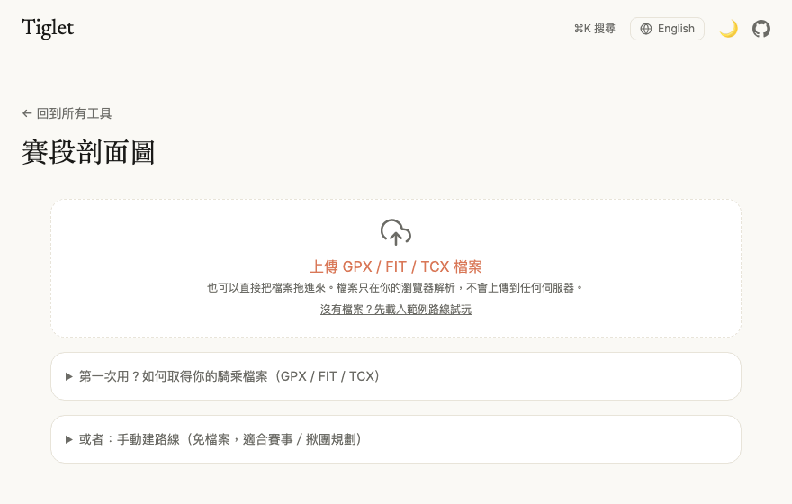
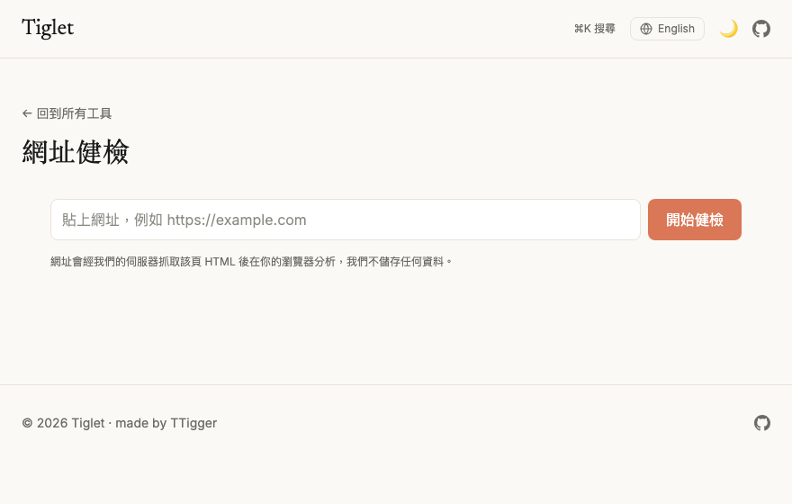

# Tiglet

**English** | [繁體中文](README.zh-TW.md)

A clean, no-login collection of small browser tools — and a personal portfolio piece.
Built with Astro + React islands + Tailwind CSS v4, deployed on Vercel.

> 🔗 **Live demo:** [tiglet.vercel.app](https://tiglet.vercel.app)

Almost everything runs entirely in your browser. No accounts, no cookies, no ads —
your input never leaves your device. (The exceptions: a few tools fetch public data
like exchange rates or official lottery numbers, and anonymous page views are counted;
see [Privacy](#privacy).)

## See it in ten seconds

**Stage Profile** — drop in a GPX and get a Tour-style stage chart: hover readout,
auto-categorized climbs, and switchable export themes (including midnight dark):



**URL Audit** — paste a URL and get an SEO / social-card / AI-readiness score with a
simulated share preview (here it is auditing one of its own pages — 100/100):



## Features

- **Bilingual** — full Traditional Chinese and English UIs (`/` and `/en/`), with a one-click language toggle and hreflang-linked pages
- **⌘K command palette** — jump to any tool from anywhere
- **Light / dark mode** — warm, low-contrast theme with a one-click toggle (no flash on load)
- **Favorites & recently used** — pin the tools you use, surfaced on the home page
- **One-click copy** — every result has a copy button
- **Shareable deep links** — tool state lives in the URL (e.g. the wheel's options)
- **Playful, accessible animations** — dice tumble in 3D, the wheel decelerates, the timer
  ring drains, the raffle reels, 2048 tiles pop; all respect `prefers-reduced-motion`
- **SEO-ready** — canonical URLs, per-tool bilingual Open Graph share cards (66+ pre-rendered PNGs), JSON-LD, and an auto-generated sitemap
- **Installable PWA** — add to your home screen, use it offline, and share / open route files straight into Stage Profile

## Tools

| Category | Tool | What it does |
|----------|------|--------------|
| Calculators | **Calculator** | Four-function calculator with keyboard input |
| Calculators | **Text Calculator** | Type an expression, get the result (safe parser — no `eval`) |
| Calculators | **Converter** | Unit conversion (length, mass, temperature, area incl. _ping_, volume, speed, data) plus live currency conversion |
| Calculators | **Everyday Calc** | BMI (Taiwan HPA bands), percentage helpers, discounts, tip-splitting, and Chinese uppercase amounts — in tabs |
| Calculators | **World Clock** | Live multi-city clocks with DST-aware offsets, time differences, and a from-zone → to-zone time projection |
| Calculators | **Date Calculator** | Date differences, date projection (with month-end clamping), shareable countdowns, and workday counting |
| Games | **Tic-Tac-Toe** | Two-player or vs. an unbeatable computer (minimax) |
| Games | **Bingo** | Classic 5×5 bingo caller — draws balls, daub your card, auto-detects lines, corners & blackout |
| Games | **2048** | Slide and merge tiles to reach 2048; arrow keys, WASD, or swipe, with a best-score record |
| Games | **Snake** | The classic — eat to grow, avoid the walls and yourself; keyboard or on-screen D-pad |
| Random | **Decision Wheel** | Spin a wheel of options; share the options via the URL |
| Random | **Name Raffle** | Draw winners from a list or an imported **Excel / CSV** file, with per-prize rounds |
| Utilities | **Timer** | Countdown (with presets), stopwatch, and interval training mode, with a progress ring and a beep on finish |
| Utilities | **Dice** | Roll any number of 3D d4–d20 dice (real pip faces for d6), total them, keep a roll history |
| Utilities | **QR Code** | Turn text, URLs, WiFi credentials, or a vCard business card into a downloadable QR code |
| Utilities | **QR Scanner** | Scan QR codes from your camera or an image (click / drag / paste) — URLs, WiFi and vCards parsed into structured fields; decoded entirely in your browser |
| Utilities | **Password Generator** | Customizable, ambiguity-free random passwords (Web Crypto CSPRNG) with a strength meter |
| Utilities | **Color Converter** | Convert between HEX / RGB / HSL live, with a picker and one-tap copy |
| Utilities | **Color Extractor** | Upload an image and pull out its dominant colors (median cut), copyable as HEX/RGB |
| Utilities | **Image Studio** | Compress, resize, convert (JPEG / PNG / WebP), and inspect / strip EXIF metadata, with a before/after comparison |
| Utilities | **Taiwan ID Validator** | Checksum validation for Taiwan national IDs and business numbers (2023 rule), with test-number generators |
| Utilities | **URL Audit** | Paste a URL to score its SEO, Open Graph social cards and GEO (AI-engine) readiness, with a simulated FB/X/LINE share-card preview and concrete fixes; the page HTML is fetched through a stateless proxy, then analyzed in your browser |
| Utilities | **Invoice Lottery** | Check Taiwan uniform-invoice numbers against the latest official draw — type the last 3 digits for an instant verdict, keep typing to confirm the prize tier; numbers are matched locally |
| Utilities | **Fuel Prices (TW)** | Today's CPC Taiwan pump prices (92/95/98, diesel, LPG) with this week's adjustment and a liters ⇄ amount fill-up calculator |
| Utilities | **PDF Studio** | Merge (with reordering), split by page ranges, and rotate PDFs — files never leave your browser |
| Cycling | **Gear Calculator** | Road-bike drivetrain math — gear ratio matrix, cadence→speed tables, A/B setup comparison, and derailleur capacity check, all shareable via URL |
| Cycling | **Ride Fuel** | Convert your bike computer's kJ into kcal burned and food equivalents, with carbs-per-hour fueling and sweat-rate hydration guidance |
| Cycling | **FTP Zones** | Coggan 7-zone power table with sweet spot, W/kg level reference, and heart-rate zones (LTHR or max-HR method) |
| Cycling | **Tire Pressure** | Front/rear pressure suggestion (psi + bar) from weight, tire width, tubeless and surface, with a hookless-limit warning |
| Cycling | **Stage Profile** | Upload a GPX / FIT / TCX (or drag-drop) and get a Tour-style stage profile — climbs auto-detected and categorized (HC–Cat 4), waypoints, per-km climb detail, five export themes (incl. midnight dark), shareable links, PNG / IG-story export; parsed entirely in your browser |
| Text | **Word Count** | Live character / CJK / word / line / paragraph counts with reading-time estimate, Chinese and English counted separately |
| Text | **Encoder** | Two-way Base64 (UTF-8 safe), URL percent-encoding, and HTML entities conversion with one-tap copy |
| Text | **Text Diff** | Line-level LCS diff with inline character highlighting — zero dependencies |
| Text | **JSON Tool** | Format, minify, validate (errors located to line/column by a hand-rolled scanner), and a collapsible tree view with click-to-copy JSON paths |
| Text | **Markdown Studio** | Paste or upload Markdown for a live preview (DOMPurify-sanitized), a clickable heading-outline tree, and document stats |
| Text | **Hash / UUID** | SHA-256 / SHA-1 for text and files (Web Crypto, no MD5 by design) plus batch UUID v4 generation |

## Tech stack

- **[Astro](https://astro.build)** — static output, near-zero JS on the home page
- **React** — one interactive island per tool, hydrated lazily (`client:visible` / `client:idle`)
- **Tailwind CSS v4** — design tokens via `@tailwindcss/vite`
- **Vitest** — unit tests for every tool's core logic (550+ specs)
- **Playwright** — 65 E2E specs for key flows (deep links, file uploads, ⌘K palette, i18n, serverless-backed tools with stubbed APIs), run in CI
- **[@astrojs/sitemap](https://docs.astro.build/en/guides/integrations-guide/sitemap/)** — sitemap generated at build time
- **[@vite-pwa/astro](https://vite-pwa-org.netlify.app)** — manifest + service worker
- **Web platform APIs** — Canvas for the image/color tools, Web Crypto for password generation,
  `Intl` for time zones
- Client-side **SheetJS** (`xlsx`), **`qrcode`** / **`jsqr`**, **`pdf-lib`**, and **`marked` + `DOMPurify`** (Markdown preview), all loaded per tool

## Getting started

```bash
npm install      # install dependencies
npm run dev      # start the dev server
npm test         # run the unit tests
npm run test:e2e # run the Playwright E2E tests (builds + previews the site)
npm run build    # build static output to dist/
npm run preview  # preview the production build
```

Every push to master and every pull request runs the unit tests, the production
build, and the E2E suite in GitHub Actions (`.github/workflows/ci.yml`).

Requires Node 22.12+.

## Project structure

```
src/
├─ data/tools.ts        # tool registry — the single source of truth for the launcher
├─ lib/                 # pure, unit-tested logic (one module per tool engine)
│  └─ __tests__/        # Vitest specs
├─ components/          # shared UI (Header, SearchBar, CommandPalette, CopyButton, Tabs, …)
├─ tools/               # one React island per tool (UI only)
├─ pages/
│  ├─ index.astro       # home launcher
│  └─ tools/            # one page per tool
├─ layouts/BaseLayout.astro   # shared <head>: SEO meta, JSON-LD, theme script
└─ styles/global.css    # Tailwind + design tokens (incl. dark overrides & animations)
```

The guiding principle is a strict split between **logic and UI**: each tool's behavior
lives in a pure module under `src/lib/` (easy to test in isolation), while `src/tools/`
holds only the React presentation. The home page, search, and command palette are all
driven by the single registry in `src/data/tools.ts`.

Some tools are **consolidated** behind tabs to keep the launcher compact — e.g. the
Converter (units + currency), Everyday Calc (BMI / percentage / discount / tip), and
Image Studio (compress / resize / convert) — sharing a single `Tabs` component.

## Adding a new tool

1. Add an entry to `src/data/tools.ts` (with `status: 'available'`, both zh and
   `titleEn`/`descriptionEn` fields).
2. Put the core logic in `src/lib/<tool>.ts` and a spec in `src/lib/__tests__/`.
3. Build the UI island in `src/tools/<Tool>.tsx` — accept an optional
   `locale` prop and keep user-facing strings in a colocated `L = { zh, en }` dict.
4. Create the zh page `src/pages/tools/<tool>.astro` and the EN page
   `src/pages/en/tools/<tool>.astro` (pass `locale="en"` to the island), passing
   `toolId` to `BaseLayout` so visits are tracked in "recently used".

## Deployment

The site is a static Astro build and deploys to **Vercel** with zero configuration —
import the repository and Vercel auto-detects Astro. `vercel.json` pins the build
command and output directory, and `.npmrc` keeps installs reproducible.

Every page is prerendered; there is no SSR adapter. The one exception is `api/`,
a directory of standalone Vercel serverless functions that Vercel picks up
alongside the static output. Today it holds three functions: `fetch-meta`
(URL Audit's HTML fetcher, with an SSRF guard), `invoice-numbers` (relays the
Ministry of Finance's official uniform-invoice draw), and `fuel-price` (relays
CPC's public price feed). Functions here must stay stateless — no database,
no logging of user input — and every change to `api/` is verified against the
real deployment before it ships.

## Privacy

Tiglet is almost entirely client-side — no login, no cookies, no ads. The raffle's Excel
import, the QR generator and scanner, the image and PDF tools, the color extractor, and
every other tool process your data locally in the browser and upload nothing.

The few exceptions are all stateless — nothing you send is stored:

- The **Converter** fetches public exchange rates from
  [open.er-api.com](https://open.er-api.com). No user input is sent — it simply
  downloads the latest rate table.
- **URL Audit** sends the URL you enter to a stateless serverless function
  (`/api/fetch-meta`) that fetches the page's HTML and returns it for in-browser
  analysis. The function stores nothing and keeps no logs of the URL; it also refuses
  internal/reserved addresses (SSRF guard).
- **Invoice Lottery** and **Fuel Prices** fetch official public data (the Ministry of
  Finance's winning numbers, CPC's price feed) through stateless relay functions.
  Your invoice digits are matched locally — they are never sent anywhere.
- **Vercel Web Analytics** collects anonymous, cookie-less page-view counts
  (no personal data, no cross-site tracking, nothing you type is ever sent).

---

Made by [TTigger](https://github.com/TTigger).
